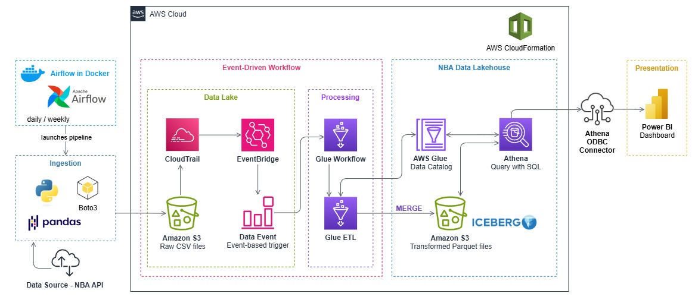
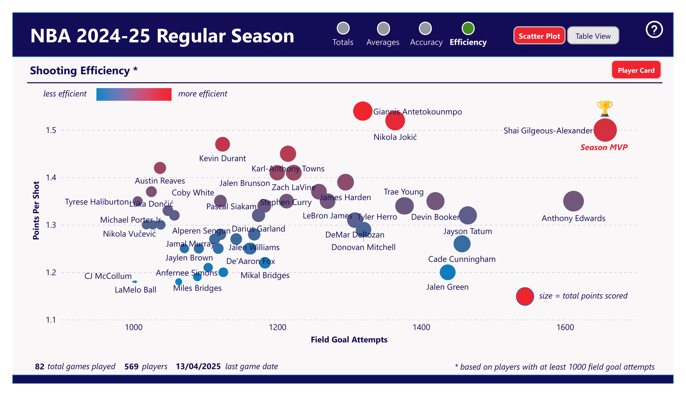
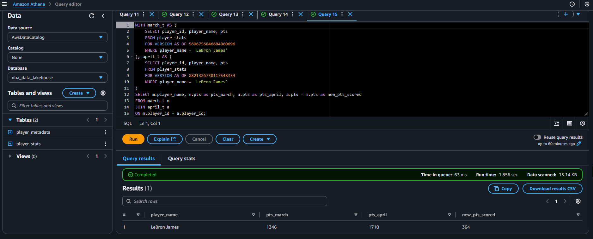
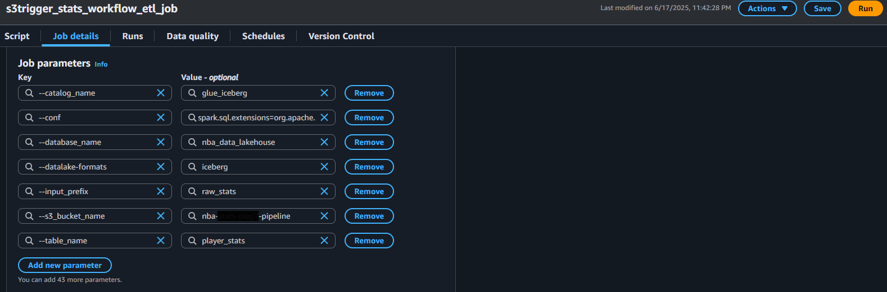
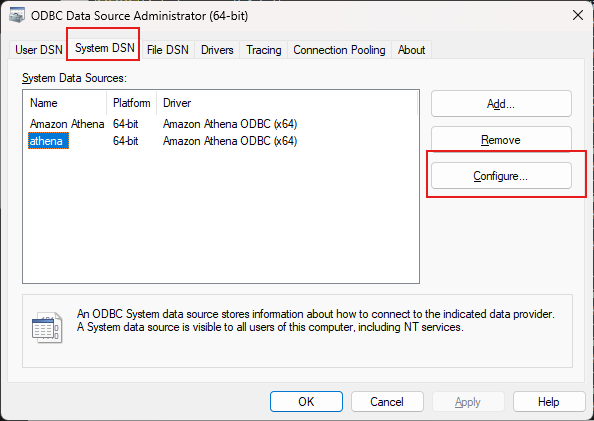
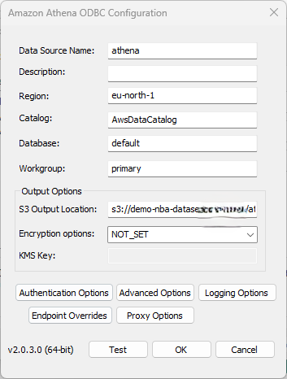
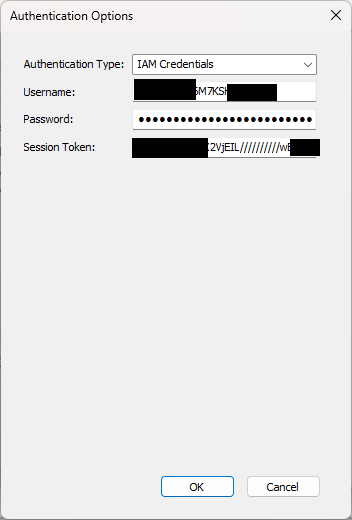
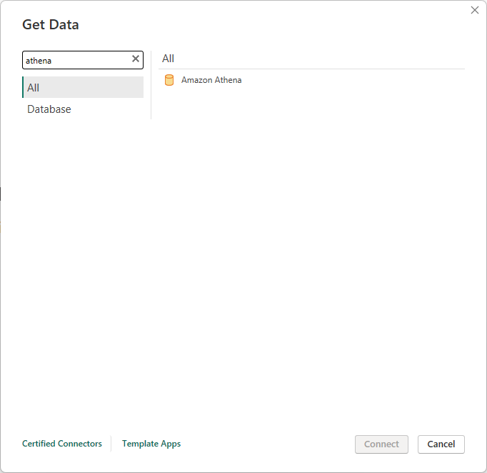
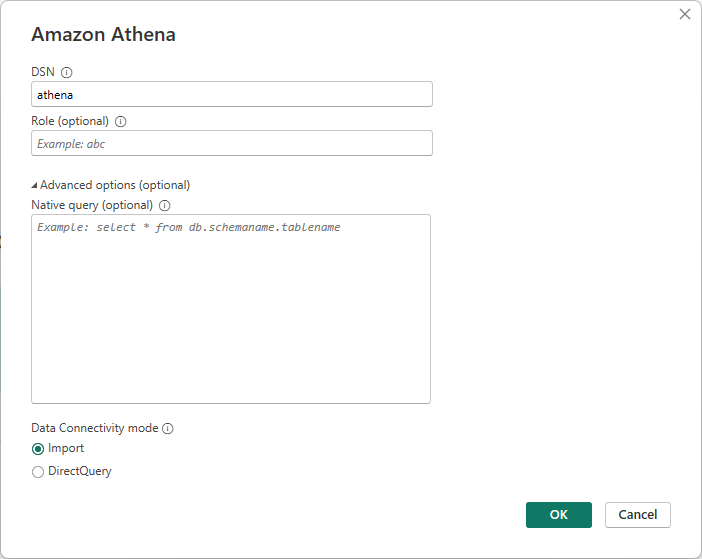

# NBA Data Lakehouse

## Table of Contents

- [Overview](#overview)
- [Business Value](#business-value)
- [Stack and Technologies](#stack-and-technologies)
- [Architecture and Workflow](#architecture-and-workflow)
- [Types of Data Processed](#types-of-data-processed)
- [Data flow: from raw to final table](#data-flow-from-raw-to-final-table)
- [Power BI Visualization](#power-bi-visualization)
- [Design Choices & Architecture Rationale](#design-choices--architecture-rationale)
  - [Why Airflow?](#why-airflow)
  - [Why Apache Iceberg?](#why-apache-iceberg)
  - [Why manual Iceberg DDL (vs. crawler)?](#why-manual-iceberg-ddl-vs-crawler)
  - [Glue Jobs: performance & cost](#glue-jobs-performance--cost)
  - [Why event-driven pipeline?](#why-event-driven-pipeline)
  - [Athena: natural choice](#athena-natural-choice)
  - [Why Power BI?](#why-power-bi)
- [Key Challenges and Debugging Notes](#key-challenges-and-debugging-notes)
- [How to Run This Project](#how-to-run-this-project)
- [Feedback](#feedback)
- [License](#license)


## Overview

The NBA (National Basketball Association) is the world's top professional basketball league, with 30 teams across the US and Canada.
Each regular season runs for about 6 months (October to April), with over 1,200 games played and player statistics updated daily, including points, rebounds, assists, and more.

This creates a rich, fast-changing dataset, ideal for automated data pipelines and BI dashboards.

And so, I built such a pipeline: **an event-driven AWS Lakehouse architecture (Airflow + S3 + Glue + Iceberg + Athena + Power BI) that ingests and transforms NBA player stats throughout the season**.

In addition to its practical purpose, this project also helped me gain deep hands-on experience with AWS data architecture and played a key role in preparing for and passing the [**AWS Certified Data Engineer - Associate (DEA-C01) exam**](https://aws.amazon.com/certification/certified-data-engineer-associate/).

---

## Business Value

This type of automated NBA data pipeline delivers clear business value:

* Provides up-to-date player performance insights at any time in one click, without manual data processing.
* Enables advanced analysis and reporting: team managers, scouts, or analysts can explore trends, player form, and key metrics across the season.
* Lays the foundation for scalable analytics: the Lakehouse architecture allows expanding the data (historical seasons, play-by-play, injury data) and building predictive models (e.g. player development, MVP forecasts).
* The dashboard can easily be shared with non-technical stakeholders, coaches, marketing teams or agents.

Overall, the pipeline transforms raw API data into a valuable analytics asset, which can serve both technical and business roles.

---


## Stack and Technologies

This project uses the following technologies and services:

- Apache Airflow (Docker)
- Python (nba_api, pandas, boto3)
- Amazon S3 (Data Lake storage)
- AWS Glue (Workflows, ETL Jobs)
- Apache Iceberg (Lakehouse table format: schema evolution, MERGE support, ACID transactions)
- AWS Glue Data Catalog
- AWS EventBridge + CloudTrail (Event-driven orchestration)
- Amazon Athena (SQL querying)
- AWS CloudFormation (Infrastructure as Code)
- Power BI (Visualization)

---

## Architecture and Workflow



The pipeline starts with Apache Airflow, running in Docker, which triggers the process daily in the afternoon (European time), after the previous NBA game day in the US has been completed and all statistics have been updated.

Airflow launches a Python script that fetches fresh NBA player statistics using the public [nba_api](https://github.com/swar/nba_api) and stores them as raw CSV files in Amazon S3.

Once new files are written to S3, CloudTrail and EventBridge detect these events and trigger the next steps of the pipeline automatically:

* A Glue Workflow launches a Glue ETL Job to clean, enrich, and calculate new metrics (such as averages, efficiency, and rankings).
* The transformed data is stored in an Apache Iceberg table (Parquet files in S3) with MERGE support for incremental updates.
* The data is registered in the AWS Glue Data Catalog, allowing easy querying.

Finally, Amazon Athena is used to query the Iceberg table and serve the data to a Power BI dashboard via ODBC, enabling daily updated visual insights into player performance.

In addition, the entire AWS part of this architecture is fully reproducible using Infrastructure as Code (IaC). Here is ready-to-use [AWS CloudFormation template](aws/nba_event_driven_workflow.yaml) which can be deployed in your AWS account to set up all the required services (S3 bucket, Glue components, EventBridge rules, CloudTrail, IAM roles, and more).

---

## Types of Data Processed

Effectively, the project consists of two parallel pipelines, one for daily stats and one for less frequent metadata updates.

1. Player Statistics

   * Retrieved from nba_api via a single API call
   * Contains game-by-game and cumulative stats for all players
   * This pipeline runs daily, since stats change after each game

2. Player Metadata

   * Includes player profile: team, position, height, weight, draft info, etc.
   * Requires looping through all players individually (as the API does not provide a bulk metadata endpoint)
   * This step takes about 5 minutes to run in standard (non-async) pandas processing

Because player metadata does not change frequently (players rarely change teams or profiles mid-season), this part of the pipeline runs less often, typically once per week or once per month.

---

## Data flow: from raw to final table

For both player statistics and player metadata, the data passes through three stages in the pipeline:

1. Raw layer
   Extracted data from nba_api is saved as raw CSV files in S3 (organized by `input_prefix`).

2. Processing layer (Glue)
   AWS Glue ETL jobs load the raw data and perform processing:

   * For player statistics:
     
     * Columns are mapped to correct data types using `ApplyMapping`
     * Additional metrics are calculated: per-game averages, shooting efficiency, points per shot
     * Ranking columns are calculated using Spark Window functions (PTS rank, REB rank, etc.)
     * A new column `ingestion_date` is added for tracking
   
   * For player metadata:
     
     * Data is cleaned and normalized:
       * Birthdate converted to date format
       * Height and weight converted to metric units (cm, kg)
       * Draft data cleaned
     * `ingestion_date` column is added

   The processed data is registered as a temporary Spark view:

   ```python
   df.createOrReplaceTempView("tmp_player_totals_view")  # or tmp_player_metadata_view
   ```
   (This could also be persisted as a separate table, but for simplicity, a temporary view is used.)

3. Final layer (Iceberg table, curated data zone)
   The data is merged into an Iceberg table using a `MERGE` command:

   ```sql
   MERGE INTO {iceberg_catalog}.{glue_database}.{glue_table} t
   USING tmp_player_totals_view s
       ON t.player_id = s.player_id
   WHEN MATCHED THEN UPDATE SET *
   WHEN NOT MATCHED THEN INSERT *
   ```

---

## Power BI Visualization

At the end of the pipeline, I built a Power BI dashboard that visualizes the latest player statistics from the Iceberg tables.



The dashboard allows you to explore:

* Player totals and averages
* Shooting efficiency and accuracy
* Efficiency metrics (e.g. points per shot)
* Top players by different criteria

Example materials:

* [Example dashboard views (April 2025, all games played)](dashboard/nba_report_april.pdf)
* [Example middle-of-season report (March 2025)](dashboard/nba_report_march_example.pdf)
* [Power BI dashboard file (.pbix)](dashboard/nba_report.pbix)

---

## Design Choices & Architecture Rationale

One of the key goals of this project was to get hands-on experience with cloud data architecture, as I believe cloud platforms provide the best flexibility, scalability, and modern tooling for data engineering today. Since I was also preparing for the AWS DEA-C01 exam, I chose AWS as the platform for this project. At the same time, I believe that the same architectural approach could be implemented on any major cloud provider.

### Why Airflow?

Apache Airflow does a great job orchestrating batch pipelines. Alternatives could have been AWS Step Functions or simply AWS Glue Workflows. However, I chose Airflow because:

* It is simple, flexible and open-source
* It runs easily in Docker
* And most importantly, free for personal projects

### Why Apache Iceberg?

In theory, I could have just used CSV files and registered them in Glue Data Catalog. However, I wanted a scalable and modern table format to build a Data Lakehouse, and Iceberg offers:

* Full schema evolution
* MERGE support (almost like a database) to not rewrite the whole table again
* Partitioning and [time-travel capabilities](https://docs.aws.amazon.com/athena/latest/ug/querying-iceberg-time-travel-and-version-travel-queries.html)

Here is an example of such a time-travel query, using Iceberg versioning to compare the same player across two table snapshots:

```sql
WITH 
march_t AS (
    SELECT player_id, player_name, pts
    FROM player_stats
    FOR VERSION AS OF 5696756846684860696
    WHERE player_name = 'LeBron James'
),
april_t AS (
    SELECT player_id, player_name, pts
    FROM player_stats
    FOR VERSION AS OF 8821326730117548334
    WHERE player_name = 'LeBron James'
)

SELECT 
    m.player_name, 
    m.pts AS pts_march, 
    a.pts AS pts_april, 
    a.pts - m.pts AS new_pts_scored
FROM march_t m
JOIN april_t a
ON m.player_id = a.player_id;
```




Also, Iceberg is a topic I was curious to explore, and after this project, I can definitely say it was worth it.

### Why manual Iceberg DDL (vs. crawler)?

If you look inside the [CloudFormation IaC template](aws/nba_event_driven_workflow.yaml), you'll see many lines dedicated to defining the Iceberg tables.
Technically, I could have used AWS Glue Crawler, but:

* In this project, the schema doesn't change during the season
* It was a great learning experience to define tables manually
* Crawlers cost extra, and for this project I optimized for cost

### Glue Jobs: performance & cost

Glue Jobs in this project turned out to be quite affordable: less than $2 total for ~30-40 runs.

AWS Glue provides multiple job types:

* Glue Spark Jobs - for distributed processing and large-scale ETL (used here)
* Glue Python Shell - ideal for light to medium ETL and small files (which would also fit this project)
* Glue for Ray - for highly parallel ML and compute-intensive tasks

For small files like in this project, AWS generally recommends Glue Python Shell for faster startup and lower cost.
However, I intentionally used Glue Spark Jobs to gain hands-on practice with DynamicFrames and Spark transformations as both critical for scaling pipelines (and core topics in DEA-C01).

Other learnings:

* If the AWS region supports it, using Flex Jobs is a good way to optimize costs further.
* PySpark in Glue proved very flexible and powerful.

Here are the two Glue Jobs used in this project:

* [nba_totals_etl.py](aws/nba-totals-etl.py)
* [nba_metadata_etl.py](aws/nba-metadata-etl.py)

### Why event-driven pipeline?

Could I have just pressed a button? Or used a Lambda function? Sure, but that wouldn’t give a smooth, fully automated workflow.
Instead, I implemented event-driven orchestration using CloudTrail + EventBridge. You can find a great AWS best practice guide here: [Build a serverless event-driven workflow with AWS Glue and Amazon EventBridge](https://aws.amazon.com/blogs/big-data/build-a-serverless-event-driven-workflow-with-aws-glue-and-amazon-eventbridge/)

### Athena: natural choice

Amazon Athena was an obvious choice here:

* Query-based pricing - I ran lots of queries for testing, and paid nothing significant
* Works great with Parquet format, which reduces scan times dramatically
* Integrates easily with Iceberg and Glue Data Catalog

Here is an example query that can be run in Athena to find the player with the highest average points per game:

```sql
SELECT
  t.player_name,
  t.pts_per_game,
  m.country
FROM player_stats t
LEFT JOIN player_metadata m ON t.player_id = m.player_id
WHERE t.pts_per_game = (
  SELECT MAX(pts_per_game)
  FROM player_stats
)
```

### Why Power BI?

To be honest, there are many alternatives here.
But I chose Power BI because:

1. It is one of the most popular BI tools on the market, and I expect to use it on real projects
2. I had prior experience with Power BI during my time at EY as a Business Analyst, which made it easy to build exactly the dashboards I wanted.

---

## Key Challenges and Debugging Notes

Building this pipeline involved plenty of small debugging steps, below are some key challenges I encountered, and how I solved them.

### AWS Glue Job Tuning and Debugging

Getting AWS Glue Jobs to run correctly required several iterations:
* Spark configuration parameters can be tricky to get right, one issue was that custom parameter names must use underscores instead of hyphens (`--my_param` instead of `--my-param`). It took me 1-2 hours of trial and error (and thanks to StackOverflow!) to identify this.



* The main method for debugging Glue ETL jobs is to check Spark driver and executor logs, which can be found in the AWS Console under

  * AWS Glue > Jobs > Select your Job run > View Logs in CloudWatch
    
* I also used minimal Spark resource settings to avoid overspending, especially during development. For example, only 1-2 workers with basic G.1X instance type. It's very important to be careful here: Glue will happily spin up 10+ large instances even for a small CSV job if you're not explicit with configuration, which can result in unnecessary costs.
* In addition, about $1 was accidentally spent when I experimented with the Visual ETL builder in Glue. Specifically, using the "preview schema" and "data preview" options in the UI automatically triggered a Glue Job run. It's important to be aware of this, even when testing inside the Visual ETL interface, such actions will launch actual Jobs and incur costs.

### Glue + Iceberg integration

Iceberg integration with Glue requires careful attention, not everything is obvious at first:

* This [official AWS Glue + Iceberg programming guide](https://docs.aws.amazon.com/glue/latest/dg/aws-glue-programming-etl-format-iceberg.html) was extremely helpful.
* Also very useful: [Deploying Apache Iceberg on AWS - prescriptive guidance](https://docs.aws.amazon.com/prescriptive-guidance/latest/apache-iceberg-on-aws/iceberg-glue.html)

Without reading these carefully, it's easy to run into issues.

### Airflow setup

Airflow is a very powerful orchestration tool, but initial setup does take some time:
* I first tried running it locally (similar to running on EC2), but managing all dependencies this way wasn't very convenient.
* Running Airflow in Docker Compose turned out to be much easier, since it cleanly installs all dependencies and can be easily restarted as needed.

### IAM permissions and bucket policies

Managing IAM policies and S3 bucket policies was one of the more challenging parts:

* For example, CloudTrail (used to trace `PutObject` events) needs not only `Get` permissions, but also `PutObject` permissions to upload its own logs.
* Each AWS service requires carefully scoped permissions to interact with others, and it's important to follow least privilege principle, rather than using wildcard permissions.
* This was a common source of "pipeline blocked" issues during development, fixing fine-grained permissions was often required to get components working smoothly.

---

## How to Run This Project

You can easily try this project yourself, no API keys required, just AWS credentials.

### 1. NBA API

* The nba_api does not require any keys, just install the requirements:

```bash
pip install -r requirements.txt
```

### 2. AWS Credentials

You will need AWS credentials:

1. In `/config/` create a `.env` file (see example `.env.example`)
2. Add your AWS access and secret keys there
3. The S3 bucket name in your `.env` file must match the one used when creating the CloudFormation stack

### 3. Launch Airflow (Docker)

Run Airflow using Docker Compose:

```bash
docker compose up --build
```

Then restart the container once, on the first launch Airflow creates its default user account.

### 4. Deploy AWS Infrastructure (CloudFormation)

Open AWS CloudFormation console:
Upload the provided [`nba_data_pipeline.yaml`](aws/nba_event_driven_workflow.yaml) file.
During creation:

* Specify Bucket Name and Stack Name
* Then just click Next and Create Stack

Takes about 3 minutes to deploy.

### 5. Run the Pipeline

Once deployed:

1. Open Airflow UI on `localhost:8080`
2. You will see two DAGs: one for player stats, one for player metadata
3. Run the DAGs, after success you will have two Apache Iceberg tables ready!

### 6. Explore the Data (Athena / Power BI)

You can query the Iceberg tables using Athena directly, or as shown here, use Power BI with ODBC connector.


### 6. (Bonus) Setting up Athena ODBC Driver

First, download and install the Amazon Athena ODBC Driver:  
[https://docs.aws.amazon.com/athena/latest/ug/connect-with-odbc-and-power-bi.html](https://docs.aws.amazon.com/athena/latest/ug/connect-with-odbc-and-power-bi.html)

1. Open ODBC Data Sources (64-bit)

2. Go to System DSN tab -> Configure Amazon Athena ODBC



3. Fill in Athena connection details (Region, S3 Output, etc.)



4. Set IAM Authentication -> use session token generated via AWS CLI

To get temporary AWS credentials for Power BI, use:

```bash
aws sts get-session-token --duration-seconds 3600 --profile myprofile
```

Useful links:

* [awscli get-session-token](https://awscli.amazonaws.com/v2/documentation/api/latest/reference/sts/get-session-token.html)
* [AWS IAM Credentials: STS](https://docs.aws.amazon.com/IAM/latest/UserGuide/id_credentials_sts-comparison.html)



5. In Power BI -> Get Data -> Amazon Athena



6. Select your DSN and connect



---

## Possible Improvements and Next Steps

There are many ways this project could be extended or improved, both in terms of data and technology.

### Data Extensions

* Expand the depth of data:
  
  * Load play-by-play logs (for more advanced metrics and modeling)
  * Load historical data for past seasons (currently the project focuses on the current season)

* In this project, the priority was building a scalable and automated pipeline, but adding deeper historical data would be a natural next step.

### Ingestion improvements

* Currently, ingestion is done on-premises using pandas.
* For higher scalability (e.g. if loading many seasons or processing more granular data), it would make sense to:
  * Move ingestion to the cloud (e.g. AWS Glue or AWS Lambda)
  * Or run Spark-based ingestion on-premises or in the cloud

* This would allow faster parallel processing of larger datasets.

### Monitoring & Alerts

* As the pipeline grows in complexity (more data sources, more jobs), adding monitoring and alerting would be very useful.
* This can be implemented via:
  
  * CloudWatch Logs and Metrics, to monitor job execution times, failures, data freshness.
  * Amazon SNS (Simple Notification Service), to send automatic alerts (e.g. email or Slack) if a Glue Job fails or if a DAG run in Airflow fails.

### Data warehouse considerations

* The Lakehouse approach (S3 + Iceberg + Athena) works very well:

  * It is budget-friendly
  * Scales well for current data volumes
  * Provides flexible querying, almost like a database

* Alternatives:
  
  * If more complex analytics or larger volumes were needed (e.g. full historical data + play-by-play + advanced modeling), it would make sense to consider Amazon Redshift.
  * A traditional RDS database (e.g. PostgreSQL) could also be used, but for larger data volumes or more concurrent BI workloads, it would be less cost-effective and not as easily scalable as a Lakehouse architecture (S3 + Iceberg + Athena).

### Partitioning

In this project, because the data was relatively small (current season only), I did not implement partitioning.
However, adding partitioning (e.g. by season, month, or team) would significantly improve scan performance as the dataset grows.

Without partitioning:

* Glue Jobs do not benefit from partition pruning (i.e. skipping unnecessary partitions during scans).
* There is also no pushdown predicate to the storage layer, so filters are applied after reading full data.


### Merge optimization

Currently, the Spark `MERGE` command in Glue updates all matching rows in the target Iceberg table (using `UPDATE SET *`).
For small datasets this works well enough, but as the table grows, it would be more efficient to optimize the merge condition, so that only rows with actual changes are updated.

This would reduce unnecessary rewrites, lower costs, and improve performance, especially when the table grows to hold multiple seasons of data.

### Crawlers

* As discussed above, using Glue Crawlers could automate table registration, but was not needed for this project (fixed schema, manual DDL used for learning and cost reasons).

### Visualization

* There is always room to improve the Power BI dashboard:

  * Add slicers (team, country, player positions)
  * Explore correlations between metrics
  * Build predictive models (e.g. MVP predictions)

* However, meaningful predictive modeling would require deeper data, not just totals:
  
  * Play-by-play logs
  * Contextual data (injuries, schedule, rest days, etc.)

* This could be a future project as an advanced analytics layer built on top of this Lakehouse.

---

## Feedback

I'm always happy to hear any feedback, suggestions, or ideas on how this project can be further improved.

Feel free to open an issue or contact me on [LinkedIn](https://www.linkedin.com/in/oleg-ivantsov/).

---

## License

This project is released under the MIT License.
